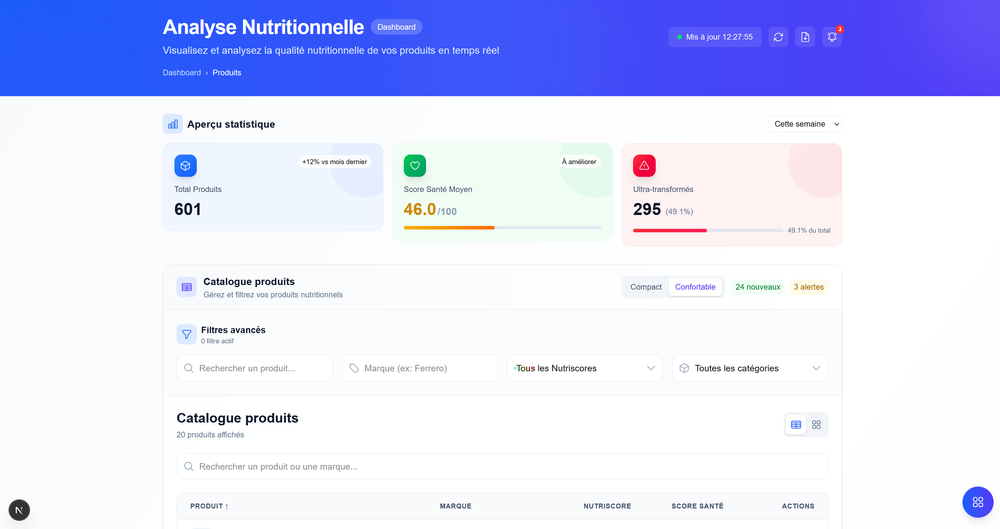

# Food Nutrition - Pipeline Data Full-Stack
Ce projet a pour objectif de concevoir une chaîne complète de traitement de données, de la collecte initiale jusqu'à la visualisation dans un dashboard fonctionnel. Le sujet choisi porte sur l'analyse de la qualité nutritionnelle des produits alimentaires en s'appuyant sur les données d'OpenFoodFacts.
[Consulter l'énoncé du TP (PDF)](TP_DataS1.pdf)




## 1. Architecture du projet
Le projet respecte une séparation stricte des responsabilités à travers un pipeline linéaire:

* 
**Collecte** : Récupération de données réelles depuis l'API OpenFoodFacts.
* 
**Stockage RAW (MongoDB)** : Conservation de la donnée brute non modifiée pour garantir la traçabilité.
* 
**Enrichissement (MongoDB)** : Transformation de la donnée brute en donnée enrichie (calcul de scores, normalisation).
* 
**ETL (Extraction, Transformation, Load)** : Passage des données de MongoDB vers une base SQL exploitable.
* 
**Base SQL (SQLite)** : Stockage relationnel optimisé pour les performances du dashboard.
* 
**API Backend (Next.js)** : Exposition des données SQL via des endpoints sécurisés.
* 
**Dashboard (React/Tailwind)** : Interface utilisateur pour la consultation et l'analyse.


## 2. Choix techniques
* 
**Framework** : Next.js (App Router) pour l'unification du frontend et de l'API.
* 
**Bases de données NoSQL** : MongoDB pour la flexibilité du stockage des données brutes (JSON natif).
* 
**Base de données SQL** : SQLite avec l'ORM Drizzle pour la simplicité de déploiement et la rigueur du schéma relationnel.
* 
**Styles** : Tailwind CSS pour une interface fluide et moderne.
* 
**Tests** : Vitest pour la validation de la logique métier et des intégrations API/SQL.


## 3. Schéma SQL
La base de données SQL est structurée autour d'une table principale `products` optimisée pour les filtres et les agrégations:

| Colonne | Type | Contrainte | Description |
| --- | --- | --- | --- |
| id | INTEGER | PRIMARY KEY | Identifiant unique SQL |
| raw_id | TEXT | UNIQUE | Référence vers l'ID MongoDB d'origine |
| name | TEXT | NOT NULL | Nom du produit |
| brand | TEXT | - | Marque principale |
| nutriscore | TEXT | - | Grade Nutri-Score (A-E) |
| category | TEXT | - | Catégorie normalisée |
| health_score | INTEGER | - | Score interne calculé (0-100) |
| is_ultra_processed | BOOLEAN | - | Indicateur NOVA 4 |
| image_url | TEXT | - | Lien vers l'image du produit |

## 4. Instructions d'installation
### Prérequis
* Node.js (v18+)
* Instance MongoDB (locale ou Atlas)

### Procédure
1. **Clonage du dépôt** :
```bash
git clone https://github.com/LucasGYnov/food_nutrition
cd food-nutrition

```


2. **Installation des dépendances** :
```bash
npm install

```

3. **Configuration des variables d'environnement** :
Créez un fichier `.env` à la racine et renseignez votre URI MongoDB :
```env
MONGODB_URI=mongodb://localhost:27017
MONGODB_DB=food_project

```


4. **Exécution du pipeline ETL** :
Ce script collecte 300 produits, les enrichit et peuple la base SQL:


```bash
npx ts-node scripts/etl.ts
```


5. **Lancement de l'application** :
```bash
npm run dev
```

L'interface est accessible sur `http://localhost:3000`.

## 5. Qualité logicielle et Tests
Le projet inclut une suite de tests automatisés pour valider chaque étape du pipeline:

### Tests Unitaires
Validations de la logique isolée sans dépendances externes:
* **Parsing** : Vérification de la structure des données d'entrée.
* **Enrichissement** : Calcul correct du score de santé interne.
* **Normalisation** : Nettoyage des libellés de catégories.
* **Mapping ETL** : Transformation fidèle de l'objet MongoDB vers SQL.

### Tests d'Intégration
Validations des interactions entre composants:
* **Requêtes SQL** : Vérification de la persistance et de la récupération des données.
* **Endpoints API** : Validation des réponses JSON pour `/api/products` et `/api/stats`.
* 
**Pipeline complet** : Test de bout en bout sur un échantillon réduit (2 produits) pour confirmer l'intégrité du flux.

**Lancer les tests** :
```bash
npm test
```

## 6. Limites du projet
* 
**Volume de données** : Le pipeline est configuré pour une collecte initiale de 300 entrées conformément aux consignes du TP.

* 
**Gestion des erreurs** : Le script de collecte gère les timeouts basiques mais ne dispose pas d'un système de reprise après erreur complexe (retries exponentiels).

* 
**Sources** : Dépendance directe à la disponibilité de l'API OpenFoodFacts pour la phase de collecte.
